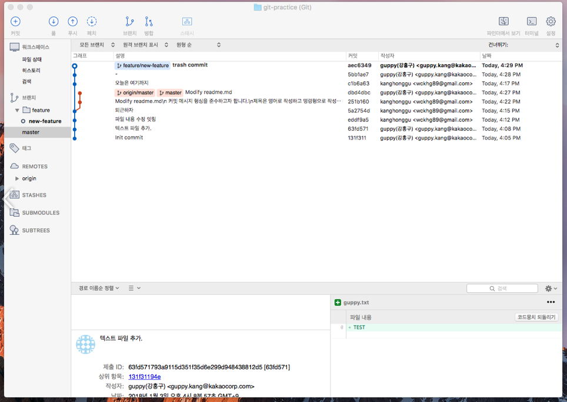
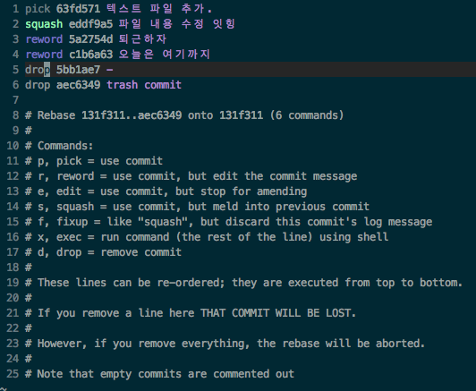
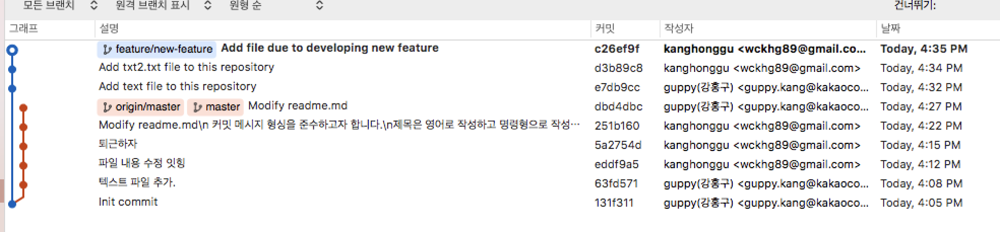

# GIT INTERACTIVE REBASE (커밋 로그 수정하기)

오늘 회사에서 기술 공유시간을 가지며 ``git rebase``의 강력한 기능에 대해 강의를 들었습니다.
``rebase``를 통해서 깃 커밋로그를 보다 깔끔하게(커밋 합치기, 커밋 지우기, 커밋 메시지 수정하기) 만들 수 있는 것이 정말 강력한 기능이라는 생각을 했습니다.
듣기만하고 '와 좋구나~'하면 결국 언젠가는 다 까먹을것 같아 간단한 깃 연습용 샘플 리파지토리를 만들어서 바로 연습을 해보았습니다.(일안하고 이런거해서 죄송합니다...)

## 본론

이번에 소개해드릴 내용은 ``git interactive rebase`` 기능을 사용하여 커밋 합치기(``Squash``), 지우기 (``drop``), 수정하기 (``reword``)를
사용해보려 합니다. CLI를 사용하여 커밋을 고쳐보고, 많이들 사용하고 계실 SourceTree를 이용해서도 커밋을 고쳐보도록 하겠습니다.

시뮬레이션을 위해서 아래와 같은 브랜치 상황을 만들어 두었습니다.



커밋 메시지를 수정하고 불필요한 커밋은 없애 버리기 위해 의도적으로 **나쁜 커밋 로그** 를 남겨두었습니다. ([좋은 커밋 로그 남기기](https://item4.github.io/2016-11-01/How-to-Write-a-Git-Commit-Message/)에 대한 내용은 이번 내용과 관련이 적어 링크로 남기도록 하겠습니다.)

``feature/new-feature`` 브랜치에서는 CLI를 이용하여 커밋을 수정해보고, ``master``브랜치에서는 SourceTree를 이용하여 커밋을 수정해보도록 하겠습니다.

### (CLI를 이용한) INTERACTIVE Rebase 를 이용한 커밋 수정

interactive rebase 를 이용하려면 다음과 같은 명령어를 통해 가능합니다.

```cli
> git rebase -i {hash-value}
```

지정한 포인트 ``윗부분``부터 커밋의 수정이 가능해집니다. 저는 '텍스트 파일 추가.'부터 커밋을 수정해보겠습니다.

```cli
> git rebase -i 131f311
```


위와 같이 명령어를 넣으면 아래와 같은 그림을 볼 수 있습니다.


> 처음에는 모두 pick 으로 되어 있습니다.

보시는 것 처럼 Init commit (131f311) 이후의 커밋에 대해 나와 있습니다.

#### 커밋 합치기
먼저 커밋을 합쳐보겠습니다. 제가 남긴 커밋중 '파일 내용 수정 잇힝' 과 '텍스트 파일 추가' 이 두가지 커밋은 거의 동일한 내용의 커밋입니다.
따라서 이 두개의 커밋을 합치려고 합니다.

> Squash : 이 명령어는 두개 또는 그 이상 커밋을 단일 커밋으로 합칠 수 있습니다. 사용할 커밋을 선택한 뒤에 이전 커밋으로 수정됩니다.
  Git은 rebase를 일시 정지하고 다중 커밋으로부터 커밋 메시지를 포함하여 텍스트 에디터를 엽니다.
  만족스럽게 메시지를 수정하고 파일에 저장한 후에 에디터를 닫습니다. Git은 rebase를 재개합니다.

``Squash``를 이용하면 적용한 커밋을 기준의로 하위의 커밋(두개 또는 그 이상의 커밋)을 하나의 커밋으로 합칠 수 있습니다.

```cli
1 pick 53fd571 텍스트 파일 추가
2 ``squash`` eddf9a5 파일 내용 수정 잇힝

... 생략

```

위와 같이하면 '파일 내용 수정 잇힝'과 그 하위 커밋인 '텍스트 파일 추가' 이 두가지 커밋을 합치겠냐고 묻게됩니다.
그러면 알맞은 커밋 메시지로 수정을 해주고 저장후 종료 (:wq!)를 해주면 두개의 커밋이 단일 커밋으로 합쳐지게 됩니다.

#### 커밋 메시지 수정하기

두번째로 커밋 메시지를 수정해보겠습니다.

> reword : pick과 유사하지만 rebase 진행을 일시 정지하고 커밋 메시지를 변경할 기회가 주어집니다. 커밋 내용은 변경되지 않습니다.

```cli
3 reword 5a2754d 퇴근하자
4 reword c1b6a63 오늘은 여기까지
```

이 두가지 커밋은 커밋 메시지가 마음에 들지 않습니다. ``reword`` 키워드로 바꾸어준 후 저장종료(:wq!)를 해주면 커밋 메시지 수정창이 나오며,
적당한 커밋메시지로 수정해주면 됩니다.

#### 커밋 지우기

마지막으로 불필요한 커밋을 삭제해 보겠습니다. 저는 '-'과 'trash commit'이라는 두개의 불필요한 커밋을 지워보겠습니다.

> drop : 커밋을 삭제한다.

```cli
5 drop 5bb1ae7 -
6 drop aec6349 trash commit

... 생략

```

위와 같이하면 해당 커밋은 사라지게 됩니다.



모든 커밋을 수정한후 위와 같이 커밋이 깔끔해진 것을 확인할 수 있습니다.
아직 지저분해 보이는 master 브랜치는 소스트리를 이용하여 수정을 진행해보겠습니다.

### (SourceTree를 이용한) INTERACTIVE Rebase 를 이용한 커밋 수정


http://minsone.github.io/git/github-advanced-git-interactive-rebase
